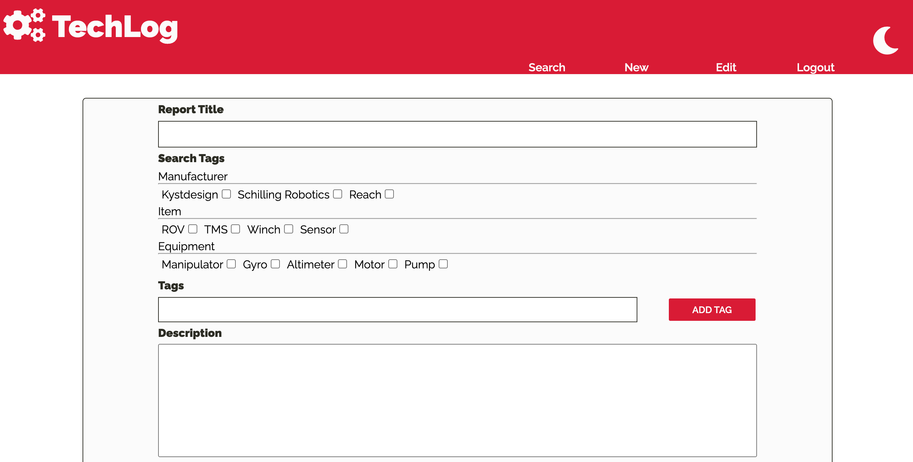
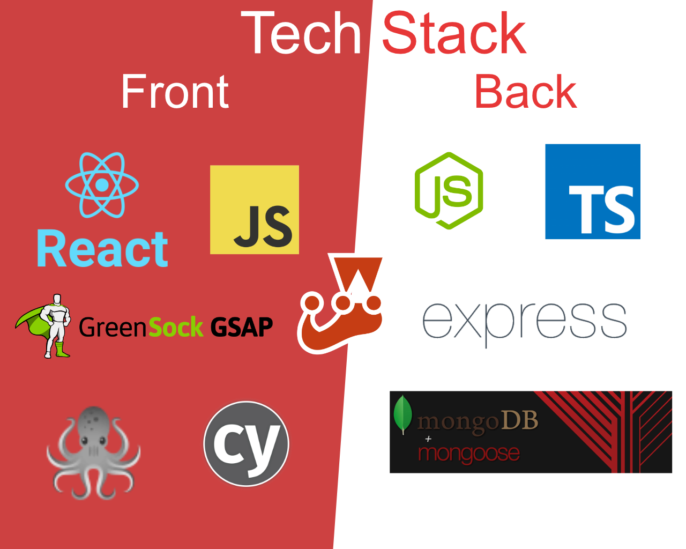

# TechLog

[toc]

## Get Started

1. Run `npm install` in the root directory, `/client/techlog` & `/server`.
2. Run `npm start` in the server to start the database.
3. Run `yarn start` in the client to start the client.
4. Contributing? Run tests before hand,
   1. Client: `npm test` & `npm cypress`
   2. Server: `npm test`

## Contributors

- Dan Bayford (https://github.com/DanB-Web) - Original Developer
- Alexander Hall (https://github.com/alexanderjshall) - Testing & Improvements
- Christopher Owen (https://github.com/awenine) - Testing & Improvements

## Examples

TechLog is a web application designed to allow those working for off-shore technical items to report on common use items and update usage notes, while searching for previously posted logs from other users.

TechLog also comes with a night-mode suitable for late-night work.

## Tech Stack

## Contributing

TechLog has a full suite of tests and uses Github actions to check pull requests, please make sure to run the tests as laid out in [Getting Started](##Get Started)